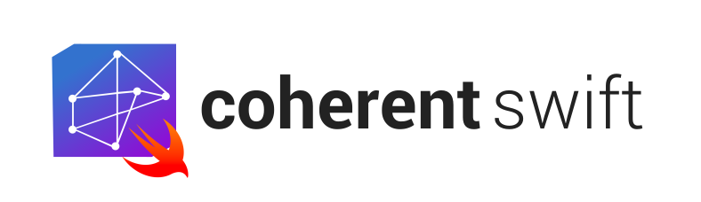
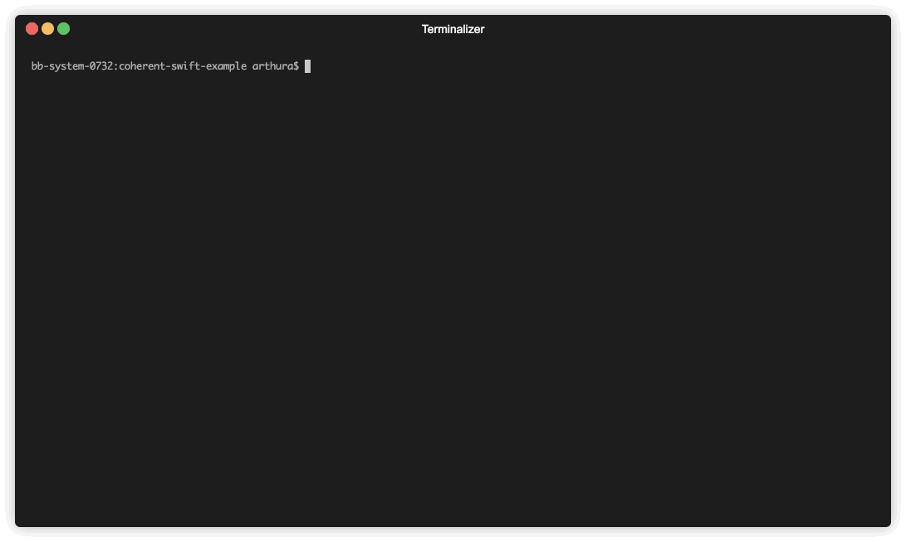
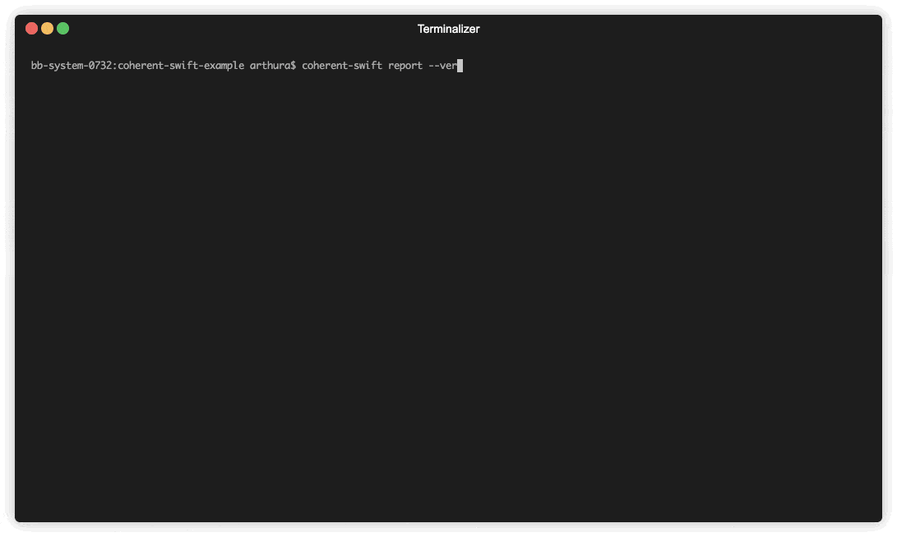

[](https://github.com/arthurpalves/coherent-swift/blob/master/LICENSE)
[](https://github.com/arthurpalves/coherent-swift/releases)
[](https://developer.apple.com/swift)


<p align="center">

</p>

<p align="center">Coherent Swift is a command line tool written in Swift that measures cohesion in your Swift codebase .</p>

## Features

- ✅ Measures the cohesion of your Swift code
- ✅ Ability to validate cohesion against a minimum threshold
- ✅ Ability to ignore output for a passive scan

## What is Cohesion?

> In computer programming, cohesion refers to the degree to which the elements
> of a module belong together. Thus, cohesion measures the strength of
> relationship between pieces of functionality within a given module. For
> example, in highly cohesive systems functionality is strongly related.
> - [Wikipedia](https://en.wikipedia.org/wiki/Cohesion_(computer_science))

> When cohesion is high, it means that the methods and variables of the class
> are co-dependent and hang together as a logical whole.
> - Clean Code pg. 140

Some of the advantages of high cohesion, also by Wikipedia:

* Reduced module complexity (they are simpler, having fewer operations).
* Increased system maintainability, because logical changes in the domain
  affect fewer modules, and because changes in one module require fewer
  changes in other modules.
* Increased module reusability, because application developers will find
  the component they need more easily among the cohesive set of operations
  provided by the module.

> coherent-swift is inspired by [cohesion](https://github.com/mschwager/cohesion).

## Installation

### Homebrew (recommended)

```sh
brew tap arthurpalves/formulae
brew install coherent-swift
```

### [Mint](https://github.com/yonaskolb/Mint)

```sh
mint install arthurpalves/coherent-swift
```

### Make

```sh
git clone https://github.com/arthurpalves/coherent-swift.git
cd coherent-swift
make install
```

### Swift Package Manager

#### Use as CLI

```sh
git clone https://github.com/arthurpalves/coherent-swift.git
cd coherent-swift
swift run coherent-swift
```

## Usage

```sh
Usage: coherent-swift <command> [options]

A command-line tool to analyze and report Swift code cohesion

Commands:
  report          Generate a report on Swift code cohesion
  help            Prints help information
  version         Prints the current version of this app
```

### Specs | Configuration

Before running the `report` command you must first have a spec/configuration file. This is a YAML file containing the basic configuration for *coherent-swift*.
This configuration is expected as follows:
```sh
source: ./MyProject/Sources/ 
minimum_threshold: 80
ignore_output_result: false
reports_folder: ./coherent-swift-reports/
```

> NOTE: By default, `coherent-swift` expects to find the configuration above in `./coherent-swift.yml`, if you do have this file elsewhere or with a different name, please specify it's path by using the parameter `-s | --spec`.

### Scan and report

```sh
Usage: coherent-swift report [options]

Generate a report on Swift code cohesion

Options:
  -h, --help            Show help information
  -s, --spec <value>    Use a yaml configuration file
  -v, --verbose         Log tech details for nerds
```

#### Example

```sh
coherent-swift report
```

<p align="center">

</p>

```sh
coherent-swift report --verbose
```

<p align="center">

</p>


## Thanks

- [mschwager](https://github.com/mschwager), who has built [cohesion](https://github.com/mschwager/cohesion), a tool for measuring Python class cohesion.
- [Omar Albeik](https://github.com/omaralbeik), colleague, whose contribution to Open Source served as inspiration to put this out here. This README is also inspired by his work on [SketchGen](https://github.com/omaralbeik/SketchGen) and inherits all appreciation to those who made that possible.

## License

coherent-swift is released under the MIT license. See [LICENSE](https://github.com/arthurpalves/coherent-swift/blob/master/LICENSE) for more information.
